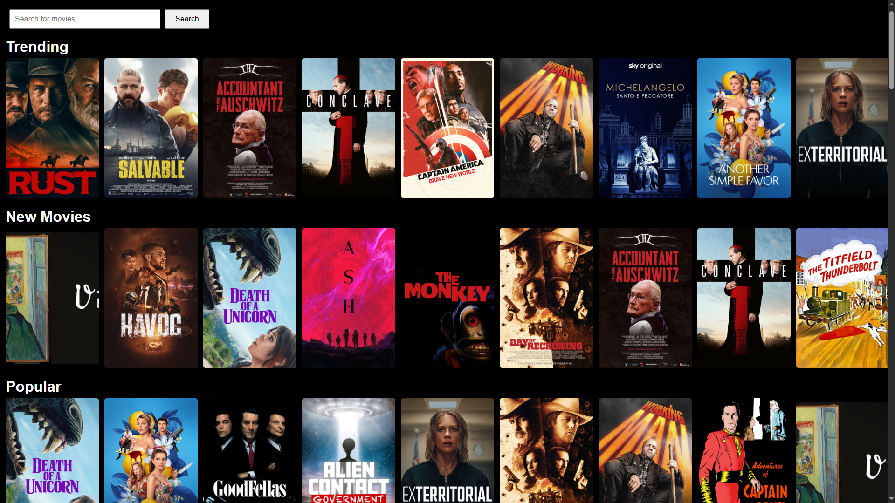
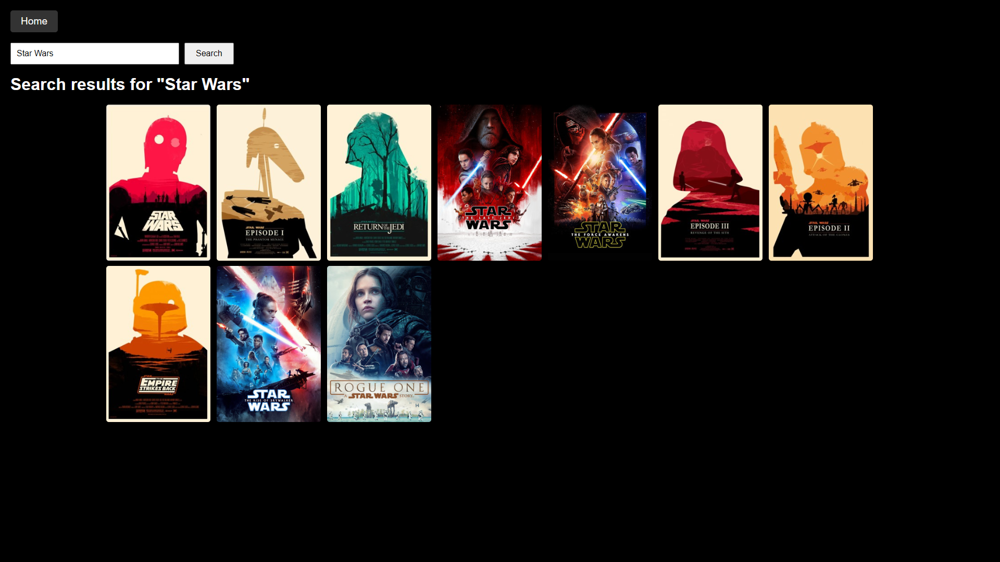
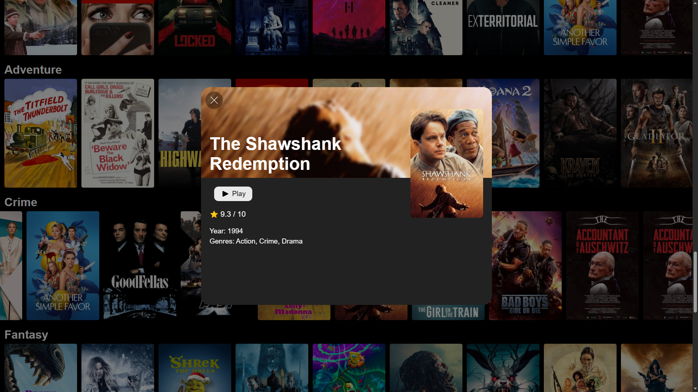
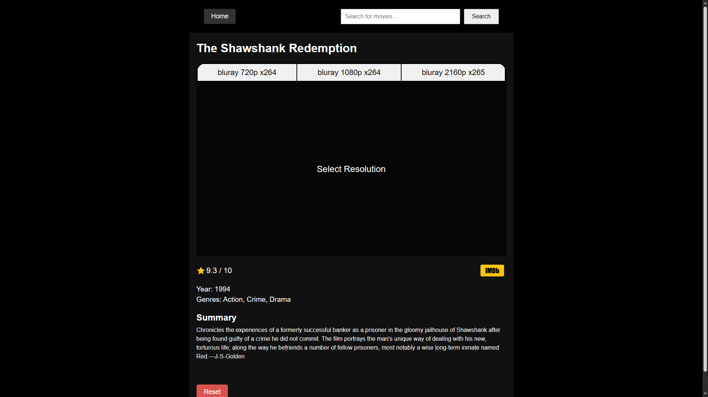

# 🎬 Streamify

Streamify is a seamless, modern, and powerful movie streaming platform that lets you watch **any movie entirely for free** — no subscriptions, no fees, no hassle. Powered by a Vue.js frontend, a Node.js backend, and a PostgreSQL database, Streamify aggregates movie details, images, and torrent links from multiple APIs and delivers a smooth streaming experience right in your browser.

## 🌟 Features

- 🔍 **Search and Explore**: Find any movie using a powerful search and discovery interface.
- 🎞️ **Detailed Movie Info**: Access high-quality posters, summaries, genres, and other metadata.
- 🚀 **Instant Streaming**: Backend fetches torrents and streams movies directly to the frontend.
- 💾 **Caching System**: Torrents are cached with an inactivity timeout to save space.
- 🧼 **Clean & Modern UI**: Built with Vue to give users a Netflix-like experience without the price tag.
- 💡 **No Subscriptions Needed**: Watch everything without logging into a streaming service.

## 🖼️ Screenshots

### 🏠 Home Page (Movie Catalog)
Browse a beautiful grid of popular and trending movies that refresh every 7 days.

### 🔍 Search Page

### 🎬 Movie Details Page
Click on any movie to view its metadata, Play button, and cover image.

### ▶️ Movie Watch Page
Start watching any movie instantly.

## 🛠️ Tech Stack

| Layer       | Technology         |
|-------------|--------------------|
| Frontend    | Vue.js             |
| Backend     | Node.js (Express)  |
| Database    | PostgreSQL         |
| Other Tools | APIs for movie metadata, searching and getting torrents |

## 📫 Contact
If you want to use Streamify yourself, feel free to contact me via email at **vencislav@manoilov.email**.
